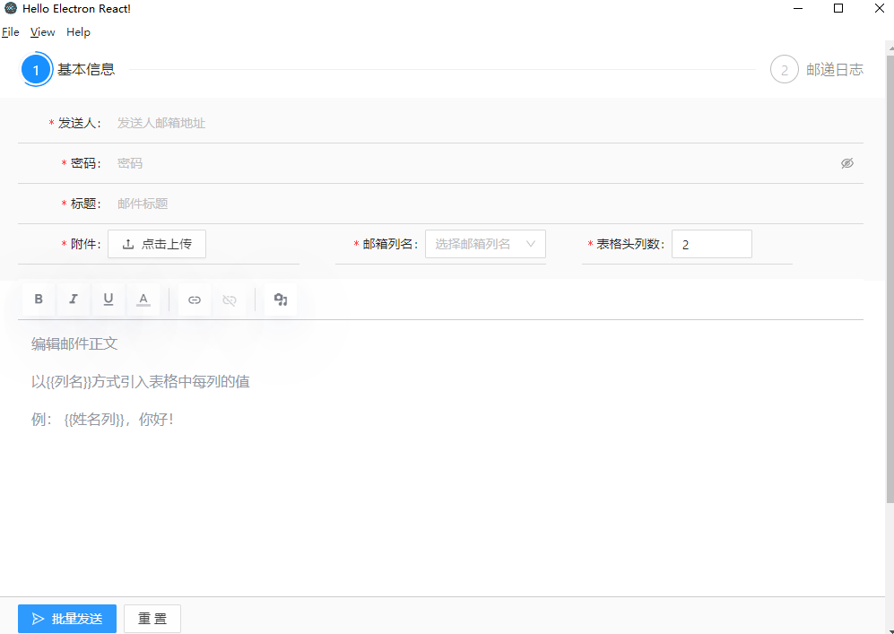

<br>

<p>
    财务助手， 工资条批量发送
</p>


## Install

Clone the repo and install dependencies:

```bash
git clone --depth 1 --branch main https://github.com/baochangliu/mail-sender.git your-project-name
cd your-project-name
npm install
```

## Starting Development

Start the app in the `dev` environment:

```bash
npm start
```

## Packaging for Production

```bash
npm run package
```

## License

MIT © [Electron React Boilerplate](https://github.com/electron-react-boilerplate)

